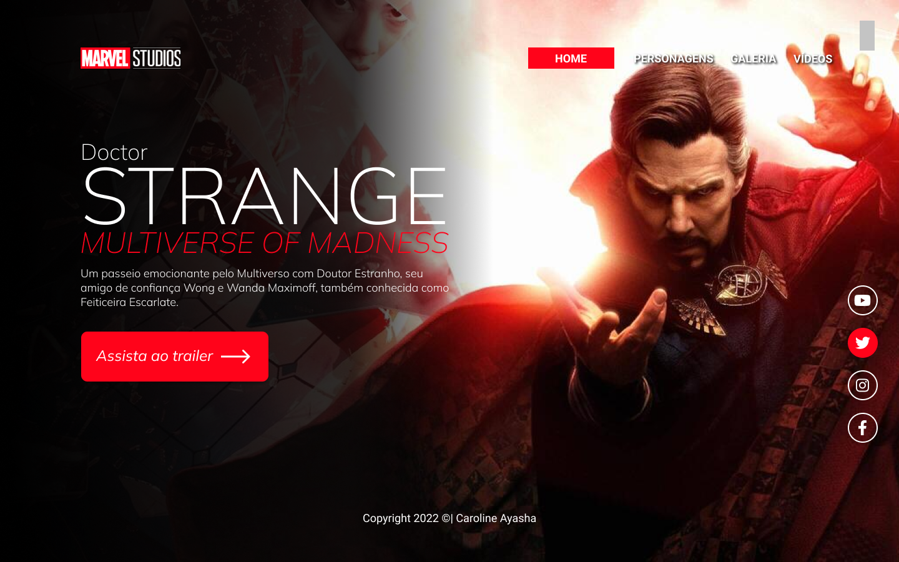
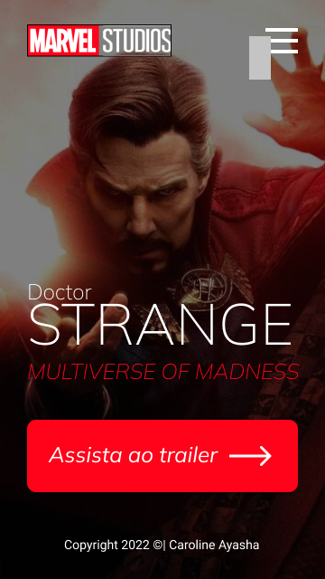
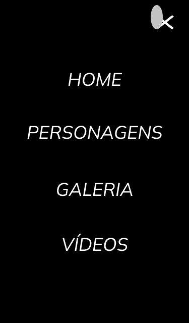

# DoctorStranger
 Projeto construido durante as aulas de LIMA, no curso de desenvolvimento de sistemas do [Senai Jandira](https://jandira.sp.senai.br/) , com orientação do Prof. [Fernando Leonid](https://github.com/fernandoleonid)

---

## Qual era o objetivo do projeto?

     O objetivo era criar uma landing page com base no design feito no figma, aprendendoa estrutura do HTML, CSS, JS e conceitos de responsividade.

---
## O que é Landing page?

     Landing page são páginas com foco principal na conversão de visitantes, assim, essas páginas possuem uma estética mais minimalista comparada com os sites tradicionais

---
## Tecnologias usadas
    - HTML 5
    - CSS 3
    - Javascript
    - Figma
---
## Links
- [Resultado](https://caroline-santana.github.io/DoctorStranger/)
- [Projeto no Figma](https://www.figma.com/file/e7dAIbARluW1RwSmQjM5gw/LIMA---Stranger2?node-id=0%3A1)
- [Código](https://github.com/Caroline-Santana/DoctorStranger)
---
## Autor
[Caroline Santana](https://github.com/Caroline-Santana)
